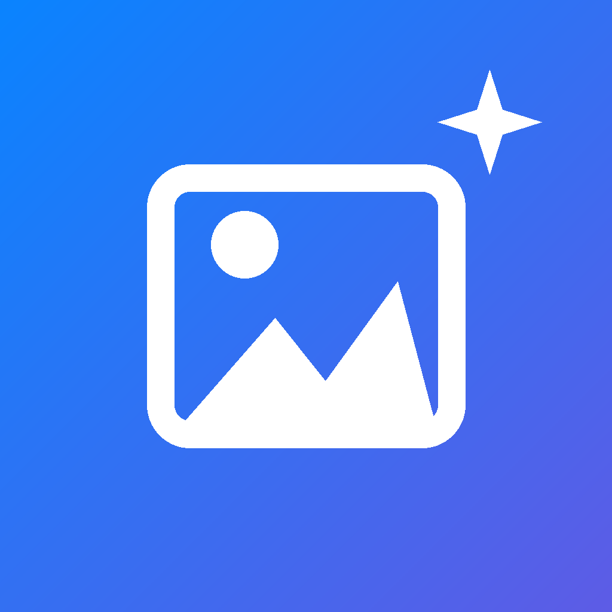

  

# MediaCleaner · 净相

An offline photo and video cleaner for iOS and Android.

[Download](https://github.com/youmikk/media-cleaner/releases/latest) · [Changelog](./CHANGELOG.json) · [Feedback](https://github.com/youmikk/media-cleaner/issues) · [中文](./README.md)

MediaCleaner is an open-source tool for organizing your photo library. Review photos and videos in small groups by album and date, with suggestions that bring duplicates, old screenshots, and large files together for review. Pause whenever you need to and pick up where you left off.

## Features

- **Group-based cleaning**: Filter by album, year, or month, choose a group size, and review your keep and delete decisions together.
- **Smart suggestions**: Review candidates for duplicate photos and videos, bursts, low-quality photos, old screenshots, and large files.
- **Shared progress**: Review history carries across categories. Confirmed items stay out of later cleaning queues, while new items remain available to review.
- **Favorites**: Collect the photos and videos you want to keep, with grid and list views.
- **Photo details**: View capture time, location, and available EXIF, and explore your shooting habits with Photography Profile.
- **Compression**: Choose a quality level and create a new file. Deleting the original remains your choice.
- **Reminders**: Set a reminder window that fits your schedule.
- **Adaptive appearance**: Light and dark themes, Chinese and English, and Liquid Glass on supported devices, with an optional toggle on Android.
- **Low Power Mode**: A notice on entry and an optional adaptation setting for glass sampling, animations, and analysis pacing.

## Privacy and Data

Photo analysis runs on your device. Review history and favorites stay locally stored, and photos and videos are not uploaded to an application server. Update checks, online release notes, and address lookups may use the network.

Marking an item does not delete it immediately; you confirm each group. Browsing and analysis do not rewrite original photos or videos.

Android offers an optional recycle bin that keeps deleted items for 30 days and supports restoration. Those items still occupy storage. iOS uses the system Recently Deleted album.

## Feedback and Contributions

Report bugs and suggest improvements through [Issues](https://github.com/youmikk/media-cleaner/issues). Code improvements and translations are welcome. For bug reports, include your device, OS version, and steps to reproduce the problem.

## License

This project uses the [MIT License](./LICENSE). Redistribute it with the required copyright and permission notices.

The Android Liquid Glass effect uses the official refraction and highlight shaders from [Kyant0/AndroidLiquidGlass](https://github.com/Kyant0/AndroidLiquidGlass/) 1.0.6, hosted in a local native View for React Native. [Integration notes](./modules/liquid-glass/README.md) · [Apache 2.0 license](./modules/liquid-glass/android/src/main/assets/licenses/AndroidLiquidGlass.txt)
